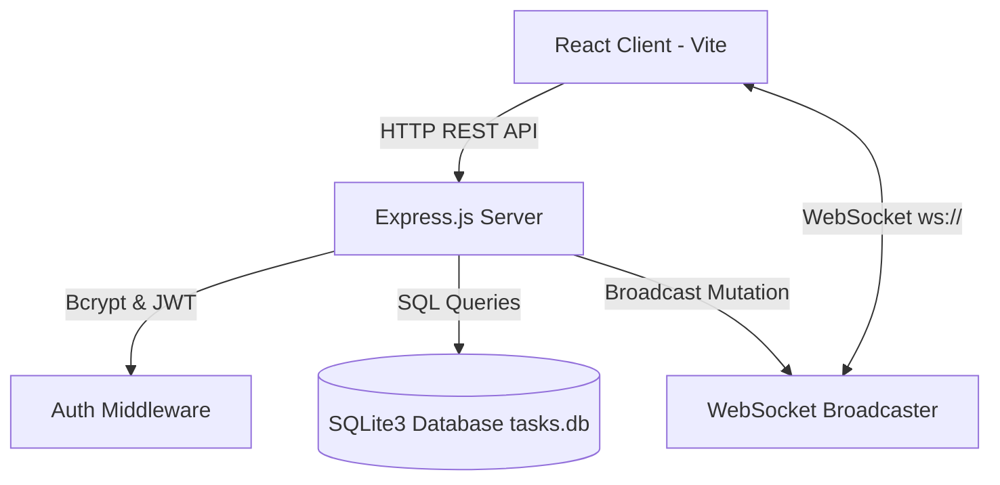

# 📋 TaskMaster Pro - Full-Stack Task Management Web Application

> **Intern Task Submission**: A modern, full-stack Task Management Web Application built with **Node.js**, **Express**, **SQLite**, **React**, **WebSockets**, and dynamic color design themes.

---

## 🌟 Project Overview

**TaskMaster Pro** is an intelligent task management web application designed to help users organize, track, and synchronize their daily workflows in real-time. 

Built with a full-stack architecture, it includes secure user registration and login (JWT + bcrypt), interactive Kanban and List task views, multi-criteria filtering and searching, visual progress analytics, and real-time WebSocket synchronization across multiple clients.

---

## ✨ Features

- **🔒 User Authentication & Authorization**:
  - Secure registration and login using **JSON Web Tokens (JWT)**.
  - Password hashing with **`bcryptjs`** (salt factor 10).
  - Protected API endpoints & strict user task data isolation (`WHERE user_id = req.user.id`).

- **⚡ Real-time Synchronization (WebSockets)**:
  - Built-in bidirectional WebSocket service (`ws://localhost:5000` or `wss://<host>`).
  - Broadcasts live task events (`TASK_CREATED`, `TASK_UPDATED`, `TASK_DELETED`) to all connected clients instantly.
  - Live status indicator pill in header (`Live Sync` connected dot).

- **🎯 Task CRUD Operations**:
  - Create, read, update, and delete tasks.
  - Statuses: **To Do**, **In Progress**, **Completed**.
  - Priorities: **Low**, **Medium**, **High**, **Urgent** (with pulsing alert pill).
  - Due date tracking with red overdue warnings.
  - Custom comma-separated tags.

- **📊 Visual Dashboard Analytics**:
  - Live completion metrics bar and percentage counter.
  - Overview cards for Total, In Progress, Completed, and Urgent Pending tasks.

- **🎨 Flexible Views & Custom Themes**:
  - **Kanban Board View**: 3 interactive columns with quick status toggles.
  - **List View**: Structured tabular data view with sortable columns.
  - **4 Attractive Theme Presets**: Switch between **Electric Midnight** 🌌, **Cyber Emerald** 🟢, **Sunset Nebula** 🌅, and **Crimson Cyber** 🔴.
  - **Canvas Animated Background**: Particle constellation reacting dynamically to the active color theme.

---

## 🛠️ Tech Stack

| Component | Technologies Used |
| :--- | :--- |
| **Frontend** | React 18, Vite, Lucide Icons, HTML5 Canvas, Vanilla CSS (Design Tokens & Glassmorphism) |
| **Backend** | Node.js, Express.js, WebSockets (`ws`), CORS, dotenv |
| **Database** | SQLite3 (`tasks.db` normalized SQL relational database) |
| **Security** | JWT (`jsonwebtoken`), Password encryption (`bcryptjs`) |
| **Deployment** | Configured for 1-click deployment on Render.com (`build.sh`, `render.yaml`) |

---

## 📥 Installation & Setup Instructions

### Prerequisites
- **Node.js** (v16+ recommended)
- **npm** or **yarn**

### 1. Clone the Repository
```bash
git clone https://github.com/MichaelGrifffin/task-management.git
cd task-management
```

### 2. Install Dependencies
Run the unified installer script:
```bash
npm run install:all
```
*(Or install inside server and client separately: `cd server && npm install` and `cd client && npm install`)*

### 3. Run Locally

**Start Backend Server (Terminal 1):**
```bash
cd server
npm start
```
*Backend runs on `http://localhost:5000` and WebSocket on `ws://localhost:5000`.*

**Start Frontend Client (Terminal 2):**
```bash
cd client
npm run dev
```
*Vite frontend opens on `http://localhost:3000`.*

---

## 🔑 Environment Variables

Create a `.env` file in the `server/` directory:

```env
# Server Port (Render sets this automatically in production)
PORT=5000

# Environment Mode
NODE_ENV=development

# JWT Secret Key for Session Encryption
JWT_SECRET=your_random_secure_jwt_secret_key
```

### Render Deployment Variables
When hosting on **Render.com**, configure these environment variables:

| Key | Value | Description |
| :--- | :--- | :--- |
| `NODE_ENV` | `production` | Enables production mode |
| `JWT_SECRET` | `(Click "Generate" in Render or use a strong random secret)` | Secret key for JWT verification |

---

## 📡 REST API Endpoints

### Authentication (`/api/auth`)
| Method | Endpoint | Description | Auth Required |
| :--- | :--- | :--- | :---: |
| `POST` | `/api/auth/register` | Register a new user account | ❌ No |
| `POST` | `/api/auth/login` | Login user & return JWT token | ❌ No |
| `GET` | `/api/auth/me` | Fetch logged-in user profile | ✅ Yes |

### Task Operations (`/api/tasks`)
| Method | Endpoint | Description | Auth Required |
| :--- | :--- | :--- | :---: |
| `GET` | `/api/tasks` | Get user tasks (supports `status`, `priority`, `search`) | ✅ Yes |
| `GET` | `/api/tasks/:id` | Get details of a single task | ✅ Yes |
| `POST` | `/api/tasks` | Create a new task | ✅ Yes |
| `PUT` | `/api/tasks/:id` | Update task details or status | ✅ Yes |
| `DELETE` | `/api/tasks/:id` | Delete a task | ✅ Yes |

---

## 🏗️ Architecture & Data Flow



---

## 📸 Application Screenshots Showcase

### 1. Kanban Board & Electric Midnight Theme
*Interactive 3-column Kanban board displaying To Do, In Progress, and Completed tasks with glowing priority tags.*

### 2. Tabular List View & Search Filters
*Structured tabular data view with search bar, priority filtering, and status dropdowns.*

### 3. Visual Analytics & Theme Switcher
*Dashboard analytics progress bar and top palette dropdown for switching between Electric Midnight, Cyber Emerald, Sunset Nebula, and Crimson Cyber themes.*

---

## 📄 License & Submissions

Created for **Intern Task Submission**. Free to use and modify.
